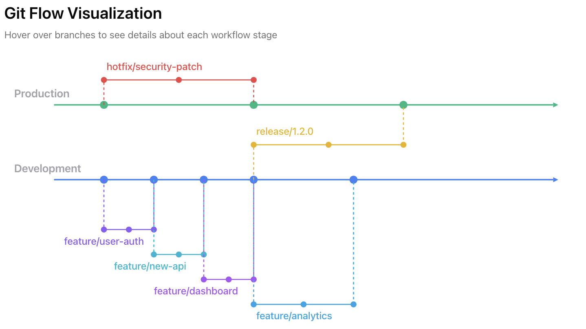

Welcome! This guide will walk you through setting up your development environment and creating your first AI-powered frontend application. We'll complete this together during the breakout session using **Legend Chatbot** — our Czech history educational chat app — and you can continue on your own afterward if we don't finish.

## What You'll Be Working On?

We will build and deploy **Legend Chatbot**, a modern web app where students choose whom to talk to — Czech History, Charles IV, Jan Hus, or Tomáš Garrigue Masaryk — and explore the past through conversation. You'll use v0 (an AI tool for generating frontend code), Cursor IDE (an AI-enhanced code editor), and industry-standard deployment practices with GitHub and Vercel.

The reference application lives in this course repository at:

```
E2E_application/
├── README.md
└── app/
    ├── backend-legend-chatbot/    # FastAPI + OpenAI (system prompts, /api/chat)
    └── frontend-legend-chatbot/   # Next.js chat UI (character images, figure selector)
```

**You will master:**
- **Environment Setup:** Set up your local development environment following professional AI engineering practices
- **AI-Powered Development:** Use v0 to generate the Legend Chatbot frontend (or start from the provided `frontend-legend-chatbot` in `E2E_application/`)
- **Version Control:** Connect to remote repositories and manage your code with Git
- **Full Deployment Pipeline:** Push code to GitHub and deploy live applications to Vercel with automatic CI/CD

By the end, you'll have created, customized, and deployed your own live Legend Chatbot frontend while learning modern development practices that mirror real-world team workflows.

---

## 📚 Table of Contents

- [What You'll Be Working On?](#what-you'll-be-working-on)
- [Prerequisites](#prerequisites)
- [Step 1: Brainstorm Your Idea 💡](#step-1-brainstorm-your-idea-)
- [Step 2: Get Your Design Resources 🎨](#step-2-get-your-design-resources-)
- [Step 3: Create Your v0 Prompt 🎬](#step-3-create-your-v0-prompt-)
- [Step 4: Set Up Your Development Environment 🛠️](#step-4-set-up-your-development-environment-️)
- [Step 5: Create Your Git Repository 🐙](#step-5-create-your-git-repository-)
- [Step 6: Clone Repository and Download v0 App in Cursor 📥](#step-6-clone-repository-and-download-v0-app-in-cursor-)
- [Step 7: Deploy to Vercel 🌐](#step-7-deploy-to-vercel-)
- [🏗️ Activity: Experiment with Your App](#️-activity-experiment-with-your-app)

---

## Prerequisites

Before we begin, make sure you have:
- [Cursor](https://cursor.sh/) installed (or Visual Studio Code)
- A GitHub account (or other Git hosting provider)
- A [Vercel](https://vercel.com/) account (free tier works great!)
- Node.js installed on your computer (Mac: `brew install node`, Windows: `sudo apt install nodejs npm`)
- Git installed and configured
- SSH keys set up for GitHub (see Step 4)

---

## Step 1: Brainstorm Your Idea 💡

For this breakout session, we'll build **Legend Chatbot** — an educational chat app where students pick a Czech historical figure and learn through conversation instead of static text.

**Conversation partners:**
- **Czech History** — a guide through the full sweep of Czech history
- **Charles IV** — Holy Roman Emperor & King of Bohemia (1316–1378)
- **Jan Hus** — Bohemian Reformer & Priest (c. 1372–1415)
- **Tomáš Garrigue Masaryk** — First President of Czechoslovakia (1850–1937)

**Option A: Use the provided frontend (fastest)**
- Open `E2E_application/app/frontend-legend-chatbot/` in Cursor
- Skip v0 generation and go straight to customization and deployment

**Option B: Generate with v0 (more creative)**
- Go to [v0.dev](https://v0.dev) or use ChatGPT to refine the concept
- Use the example prompt in Step 3 as your starting point
- Iterate until the character picker and chat UI match your vision

---

## Step 2: Get Your Design Resources 🎨

Now gather design inspiration for Legend Chatbot's scholarly, educational aesthetic. You have two paths:

#### Path A: Use v0's Premade Templates
- Browse v0's template library
- Pick a template that matches your vision

#### Path B: Create Your Own Design (More Original!)

**a) Pick a Template Style:**
- Visit [Canva Templates](https://www.canva.com/templates/)
- Find a design style you like
- Note the colors, layout, and overall aesthetic

**b) Choose Component Styles:**
- Go to [shadcn/ui Components](https://ui.shadcn.com/docs/components/)
- Browse the component library
- Pick components that match your app's needs (buttons, cards, forms, etc.)

**c) Select a Color Scheme:**
- Visit [Coolors](https://coolors.co/)
- Generate or browse color palettes
- Pick colors that match your app's mood and purpose

---

## Step 3: Create Your v0 Prompt 🎬

Now combine everything into a detailed prompt for v0:

1. Describe your app idea
2. Reference the template style you chose
3. Mention the shadcn/ui components you want to use
4. Include your color scheme
5. Add any specific features or requirements

**Example prompt structure:**
```
Create me an app: [Your App Name]

[Description of your app concept]

Use the design style similar to: [Canva template reference]
For components, use shadcn/ui with: [component names]
Color scheme: [your colors from Coolors]
```

**Example: Legend Chatbot**

```
Create me an app: Legend Chatbot

An educational chat app where middle and high school students choose a Czech historical figure to talk to: Czech History (general guide), Charles IV, Jan Hus, or Tomáš Garrigue Masaryk. Each character has a portrait image you click to select. The chat UI shows the selected character's image while conversing. Include suggested starter questions per character. Dark, scholarly design with warm chat bubbles. History as conversation, not a lecture.

Use shadcn/ui components: Button, Input, Card
Color scheme: deep slate background, emerald accents, parchment-style chat area
```

---

## Step 4: Set Up Your Development Environment 🛠️

Before we start building, ensure your development environment is properly configured.

### Key Setup Steps:

1. **Install Required Tools:**
   - Git
   - Node.js and npm
   - Cursor (or VS Code)
   - Terminal/Command Line Interface

2. **Set Up SSH Keys for GitHub:**
   - Generate SSH key: `ssh-keygen -t ed25519 -C "your_email@example.com"`
   - Copy your public key:
     - Mac: `pbcopy < ~/.ssh/id_ed25519.pub`
     - Windows (WSL): `cat ~/.ssh/id_ed25519.pub`
     - Linux: `xclip -sel c < ~/.ssh/id_ed25519.pub`
   - Add to GitHub: Settings → SSH and GPG keys → New SSH Key

3. **Configure Git:**
   ```bash
   git config --global user.email "your_email@example.com"
   git config --global user.name "Your Name"
   ```
   - **Security Note**: If you configure API keys, store them in a `.env` file (already in [.gitignore](/.gitignore#L138)) to protect sensitive data.

4. **Verify Installation:**
   ```bash
   git --version
   node --version
   npm --version
   ```

**Important:** Complete the full environment setup before proceeding. This ensures you have all the tools and configurations needed for professional development.

---

## Step 5: Create Your Git Repository 🐙

Now let's create a dedicated repository for your frontend application.

1. Go to GitHub (or your Git provider) and sign in
2. Click the **"+"** icon in the top right corner
3. Select **"New repository"**
4. Name your repository (e.g., `legend-chatbot-frontend` or `my-ai-frontend`)
5. Choose **Public** or **Private** (your choice)
6. Add .gitignore (Python), license (you can select — for copyrights, i.e. MIT)
7. Click **"Create repository"**
8. **Copy the SSH URL** (click the green "Code" button and select SSH, then copy the URL)
   - It should look like: `git@your-host:yourusername/yourrepo.git`
   - You'll need this SSH link in Step 6!

**Why start with Git first?** Setting up version control from the beginning ensures you can track all changes and makes deployment seamless.

---

## Step 6: Clone Repository and Download v0 App in Cursor 📥

### 6.1 Clone Your Repository in Cursor

1. Open Cursor IDE
2. Press `Cmd+Shift+P` (Mac) or `Ctrl+Shift+P` (Windows/Linux) to open the Command Palette
3. Type **"Git: Clone"** and select it
4. Paste your SSH repository URL (from Step 5)
5. Choose a location to clone the repository
6. Cursor will open a **new window** with your cloned repository

**You now have your GitHub repository open in Cursor!**




### 6.2 Get Your Legend Chatbot Frontend

**Path A: Copy from the course repo (recommended for the breakout)**

1. Copy `E2E_application/app/frontend-legend-chatbot/` into your cloned repository
2. Your folder structure should look like:
   ```
   your-repo/
   └── frontend-legend-chatbot/
       ├── app/
       ├── components/
       └── package.json
   ```

**Path B: Download from v0**

1. In v0, after generating your app, click **"Download"**
2. Copy the **npx command** (it should look like: `npx create-v0-app@latest`)
3. In Cursor's terminal (in the cloned repository window), run the npx command from v0:
   ```bash
   npx create-v0-app@latest
   ```
   *(Paste the exact command from v0)*

4. Follow the prompts if any appear
5. Rename the folder to `frontend-legend-chatbot` if v0 used a different name

### 6.3 Install Dependencies

1. In Cursor's terminal, navigate to your frontend directory:
   ```bash
   cd frontend-legend-chatbot
   ```

2. Install dependencies:
   ```bash
   npm install
   ```
   
   **If you encounter errors:**
   ```bash
   npm install --legacy-peer-deps
   ```

### 6.4 Run Your App Locally

1. In Cursor's terminal, navigate to your frontend directory:
   ```bash
   cd frontend-legend-chatbot
   ```

2. (Optional) If you have the backend running locally, point the frontend at it:
   ```bash
   echo "NEXT_PUBLIC_BACKEND_URL=http://localhost:8000" > .env.local
   ```
   > For frontend-only deployment in this breakout, you can skip this step. Backend integration is covered in the full Assignment.

3. Start the development server:
   ```bash
   npm run dev
   ```

4. Look for a local URL (usually `http://localhost:3000`) in the terminal

5. Open the URL in your browser

6. Verify the character picker and chat UI load correctly!

**If port 3000 is in use:**
```bash
kill -9 $(lsof -ti tcp:3000)
```

### 6.5 Generate README with Cursor 🤖

Let Cursor help you create documentation:

1. In Cursor, ask: *"Create a README.md file explaining how to launch this Legend Chatbot frontend"*
2. Cursor will analyze your project structure
3. It will generate a README with setup and launch instructions
4. Review and customize as needed

### 6.6 Commit and Push

Since you cloned the repository, it's already connected to GitHub! Now commit your v0 app:

1. In Cursor's terminal, make sure you're in the repository root (not the app folder)
2. Add all files:
   ```bash
   git add .
   ```

3. Create your first commit:
   ```bash
   git commit -m "Initial commit: Legend Chatbot frontend"
   ```

4. Push your code:
   ```bash
   git push -u origin main
   ```

5. Go to your GitHub repository and verify all files are there! 🎉

---

## Step 7: Deploy to Vercel 🌐

Now let's get your Legend Chatbot frontend live on the web!

1. In the terminal, go to your frontend folder:
   ```bash
   cd frontend-legend-chatbot
   ```
2. Deploy to production:
   ```bash
   vercel --prod
   ```

**Your app is now live and accessible to the world!** 🎉

**What just happened?**
- Vercel automatically detected your Next.js/React framework
- It built your app in the cloud
- It deployed it to a global CDN
- Every time you push to `main`, Vercel will automatically redeploy!

---

## 🏗️ Activity: Experiment with Your App

Now it's your turn to experiment with **Legend Chatbot**! Use this time to practice what you've learned and explore the tools.

**Experiment with Design Customization:**
- Refine the scholarly dark theme (slate background, emerald accents)
- Improve character portrait cards for Charles IV, Jan Hus, and Masaryk
- Try different button styles and components from shadcn/ui
- Make design changes using v0 or Cursor to iterate on the chat layout

**Try Making Changes:**
- Add or improve suggested starter questions per character in `app/page.tsx`
- Ask Cursor to improve the chat bubble styling or mobile layout
- Add a new historical figure card (UI only — backend wiring comes in the full Assignment)
- Show the active character's portrait during the conversation

**Remember:**
- Test locally with `npm run dev` before pushing changes
- Commit your changes: `git add .` then `git commit -m "your message"`
- Push to GitHub: `git push origin main`
- Watch Vercel automatically redeploy your changes!

---

## 🛠️ Troubleshooting

### npm install errors

If you encounter an `npm install` error:

1. Install with legacy peer deps:
   ```bash
   npm install --legacy-peer-deps
   ```

2. Uninstall `vaul` (problematic peer dependency in some templates):
   ```bash
   npm uninstall vaul
   ```

3. Commit the resulting dependency updates:
   ```bash
   git add package.json package-lock.json
   git commit -m "fix: resolve dependency conflicts"
   git push
   ```

4. Redeploy on Vercel. The build should now pass.

### Port 3000 in use

If port 3000 is in use:
```bash
kill -9 $(lsof -ti tcp:3000)
```

### Git push errors

If you get authentication errors:
- Make sure your SSH key is added to GitHub
- Verify your remote URL: `git remote -v`
- Try using HTTPS instead: `git remote set-url origin https://your-host/username/repo.git`

### Vercel deployment fails

- Check the build logs in Vercel dashboard
- Make sure all dependencies are in `package.json`
- Verify your `package.json` has a `build` script
- Check that your framework is supported by Vercel

### Chat shows errors or wrong responses (after backend is connected)

- Check `frontend-legend-chatbot/.env.local` — `NEXT_PUBLIC_BACKEND_URL` must point to your backend (e.g. `http://localhost:8000` locally)
- Restart `npm run dev` after changing `.env.local`
- For local development, always use `http://localhost:8000` — stale deployed backend URLs may return wrong or out-of-character responses

---

## 🎓 Tips for Success

- **Take your time** with each step - don't rush!
- **Test locally** before pushing to GitHub
- **Save your work** frequently (git commits!)
- **Experiment** with different designs and components
- **Ask questions** if you get stuck
- **Have fun** - this is your chance to be creative!

---

## 📚 Next Steps

Once you've completed this breakout session, you can:
- Continue customizing Legend Chatbot with Cursor
- Connect the frontend to the FastAPI backend in `E2E_application/app/backend-legend-chatbot/`
- Refine character system prompts in `api/index.py` so each figure sounds historically accurate
- Learn about GitFlow and feature branches (see the full [Assignment](./Assignment.md))
- Share your deployed app with others!

**Congratulations on deploying your first Legend Chatbot frontend!** 🎉

---
